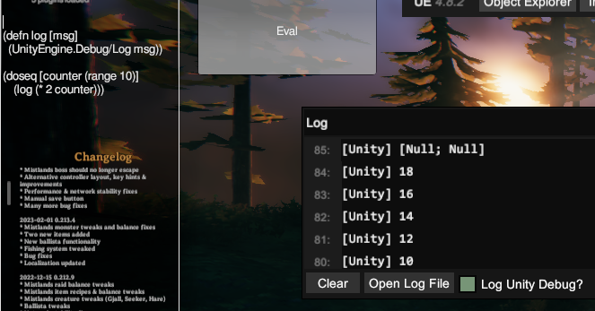

# what is this?
A work in progress (compiler|interpreter|?) for a subset of Clojure.

I wanted to learn more about interpreters, and rather than create my own language, I decided it'd be more useful to interpret an existing language and learn more lisp along the way :)

# Goals
- Implement enough of Clojure to be useful
- Have some fun
- ??
- Port parser and one mode of execution (likely AST interpretation) to be compatible with Fable
- Support generation of .NET types for Unity/Godot modding
    - [x] Generating classes and methods without params/args
    - [x] Inheriting from a base class

# Future Work
- Compilation of Clojure into LambdaExpression's or another intermediate form
- Experiment with dynamic method generation or libgccjit/MIR
- LSP impelementation with a focus on accurate type tracking and potential solutions from inference
- Transpilation into Fable's AST for some profit :)

## Motivations Pt 2
- If I spend any more time fighting with Mono v462 and the FCS API I'm going to uninstall programming.so and stop flipping tables

# Design (WIP)
- Reader using FParsec to parse strings into Clojure's basic forms (lists, vectors, numbers, etc)
- WIP: Macro evaluation refactor
- Recursive Eval function that walks the AST and evaluates the forms
  - Function execution is interpreter
- .NET Interop
  - Reflection for `.` and `Namespace.Class/Mem`
- Exploring the use of immutable data for the interpreter's evaluation loop.

# Demo: Hosting in Valheim with BepInEx 
- UnityRuntime used for console output display
 

